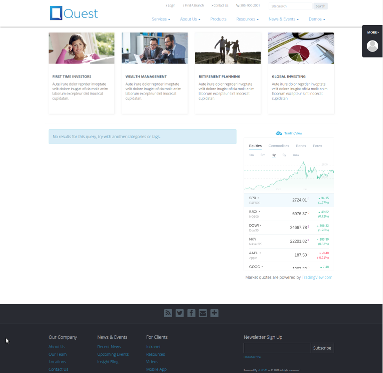

# dotcms_dockerized
Basic dockerization of dotCMS, using the default H2 database config.

NOTE: You'll probably want to get a dotCMS license, at least a [trial license](https://dotcms.com/download/trial-license.dot).

## USAGE

1. Clone [this repo](https://github.com/drhuffman12/dotcms_dockerized).

2. Place your dotCMS files under `webapp`. (e.g.: Download dotCMS the release version from https://dotcms.com/download and then unzip the contents into the `webapp` folder.)

The folder structure should look something like:

```text
$ tree -L 2
.
├── docker.clean.super.sh
├── docker-compose.yml
├── Dockerfile
├── docker.start.sh
├── LICENSE
├── logs
├── README.md
└── webapp
    ├── bin
    ├── docs
    ├── dotserver
    └── plugins

6 directories, 6 files
```

3. For non-local development, you'll probably want to [configure it for a different database](https://dotcms.com/docs/latest/installing-from-release#ConfigureDatabase).

4. As applicable, adjust the tomcat version for the `logs` volume in the [`docker-compose.yml` file](docker-compose.yml).

5. Build the container

```bash
$ docker-compose build
```
65. Build and run the container

```bash
$ docker-compose run webapp /bin/bash
root@af81004ef254:/webapp# ./bin/startup.sh
```

* NOTE: To stop the server, use the following

```bash
docker-compose stop webapp
```

7. Determine the container's IP address

```
$ docker ps -a
CONTAINER ID        IMAGE                      COMMAND              CREATED             STATUS                   PORTS               NAMES
85949693860c        dotcms_dockerized_webapp   "/bin/bash"          4 minutes ago       Up 4 minutes             8080/tcp            dotcms_dockerized_webapp_run_1

$ # docker inspect -f '{{range .NetworkSettings.Networks}}{{.IPAddress}}{{end}}' container_name_or_id
$ docker inspect -f '{{range .NetworkSettings.Networks}}{{.IPAddress}}{{end}}' 8594
172.19.0.2
```

7. Browse the website via "http://<container_ip_addr>:8080" (in this case: "http://172.19.0.2:8080")

NOTE: dotCMS takes a while to launch. From another terminal, you can watch the logs folder contents, such as:

```bash
$ tail logs/dotcms.log
```

The demo website should look something like:

.

## See also:
* https://dotcms.com/docs/latest/installation
